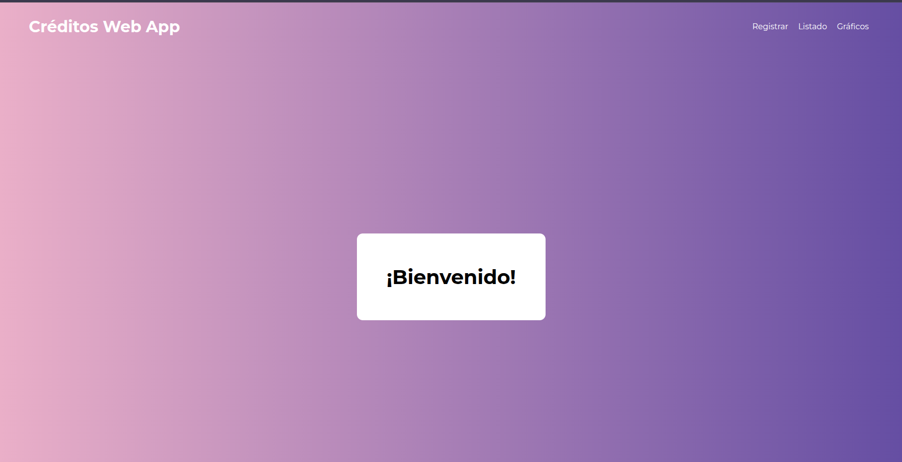
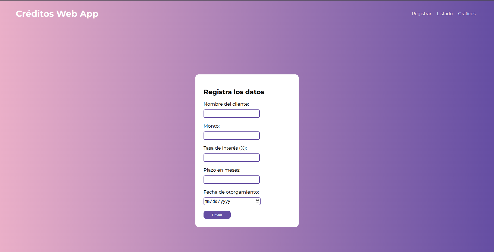
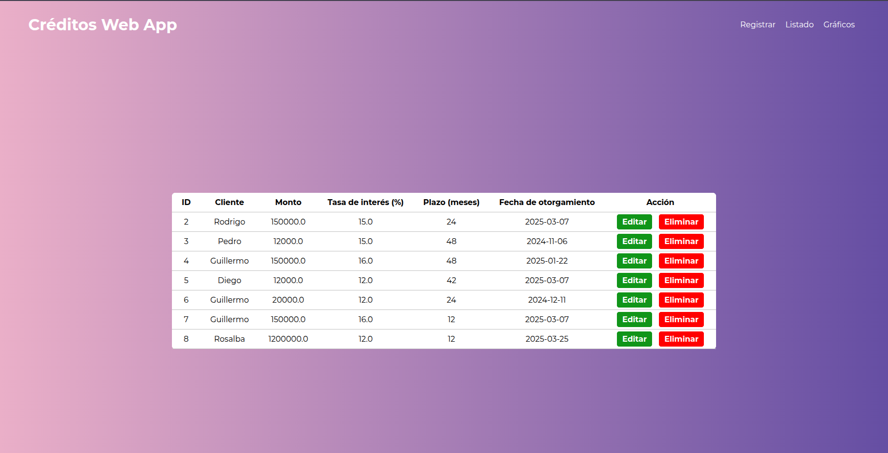
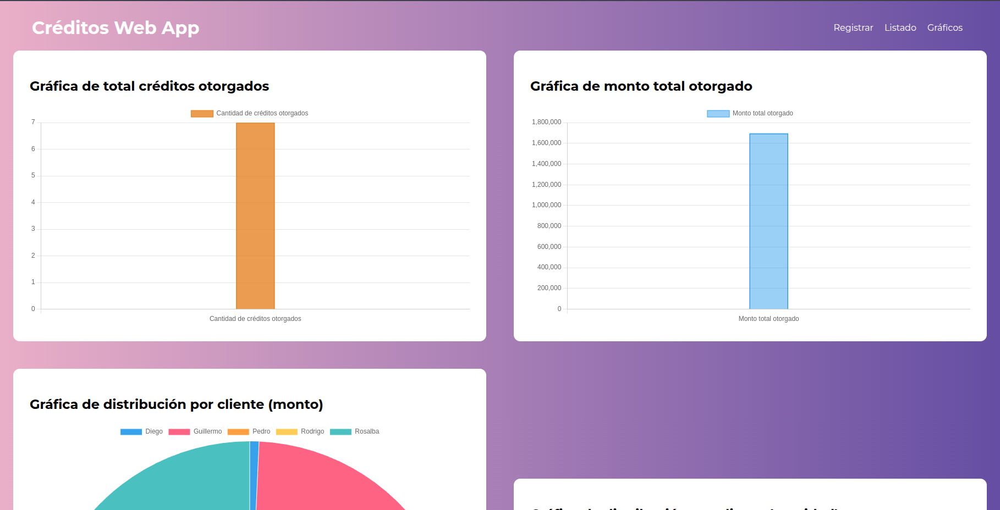
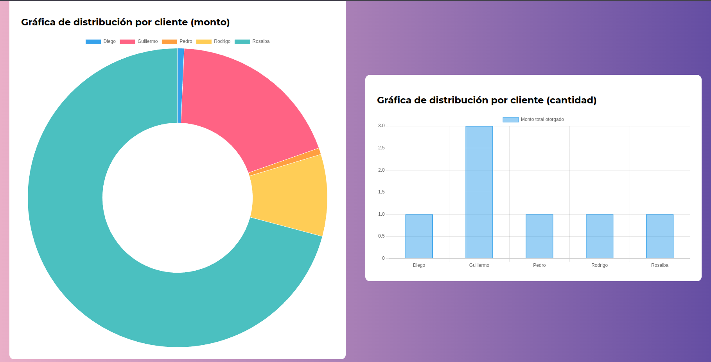

# Créditos Web App 

Esta aplicación permite gestionar créditos otorgados y mostrar gráficos que representen la información ingresada. 

### Tecnologías utilizadas
- Python
- Flask
- SQLAlchemy
- SQLite
- HTML
- CSS
- JavaScript
- Chart.js
- Jinja

### Instalación y ejecución del proyecto
Para correr el proyecto se requiere seguir los siguientes pasos a continuación. 

> [!IMPORTANT]
> Se asume que existe una versión instalada de Python y Git en la computadora del usuario. 

#### 1. Clonar el repositorio
Para clonar el repositorio se debe ejecutar el siguiente comando en una terminal Git posicionado en el directorio donde se desea clonar el repositorio:

```
git clone <url_del_repositorio>
```

Mediante Github Desktop solo basta con copiar el URL para clonar el repositorio.

#### 2. Crear el entorno virtual

##### Linux/MacOS

Se debe ejecutar el siguiente comando en la terminal situada en el directorio del proyecto para crear un nuevo entorno virtual.

```
python3 -m venv .venv
```

Posterior, se debe ejecutar el siguiente comando dentro del directorio del proyecto para activar el entorno virtual. 

```
. .venv/bin/activate
```

##### Windows
Se debe ejecutar el siguiente comando en CMD de Windows situado en el directorio del proyecto para crear un nuevo entorno virtual.
```
py -3 -m venv .venv
```

Posterior, se debe ejecutar el siguiente comando dentro del directorio del proyecto para activar el entorno virtual. 
```
.venv\Scripts\activate
```
> [!NOTE]
> En caso de tener problema con la activación del entorno virtual, es posible que los permisos del usuario en el equipo estén restringidos, por lo que se sugiere ejecutar la CMD como administrador, o bien, ejecutar el siguiente comando.

```
Set-ExecutionPolicy -Scope CurrentUser unrestricted
```

> [!CAUTION]
> Este comando habilita la ejecución de scripts al usuario en cuestión, por lo que es importante tomarlo en cuenta si no se desea ceder permisos.

#### 3. Instalar las librerías necesarias
Este proyecto requiere de dos librerías para funcionar correctamente, las cuales son: **Flask** y **Flask SQLAlchemy**. Para instalarlas, se deben ejecutar los siguientes comandos **pip** en la terminal o CMD una vez que se activó el entorno virtual.

```
pip install Flask

pip install -U Flask-SQLAlchemy
```


#### 4. Iniciar el servidor
Dentro del archivo **app.py** se encuentran importadas todas las configuraciones necesarias para que la aplicación pueda funcionar correctamente con **SQLite** a través del **ORM SQLAlchemy**, así como las rutas, modelos y vistas. Para correr el proyecto se debe ejecutar la siguiente línea de comando.

##### Linux/MacOS
```
python3 app.py
``` 

##### Windows
```
py app.py
``` 

#### 5. Abrir el navegador
Para visualizar los templates HTML recibidos de la API, se debe abrir un navegador e ingresar el siguiente URL:
```
localhost:5000/
``` 
Esto nos dirigirá a la dirección IP local en el puerto 5000 y hará una petición GET al endpoint "/" de la API.

En este punto ya se puede navegar dentro de la aplicación y utilizar las características de la misma.

## API endpoints

| Endpoint       | Descripción                                                                 |
| -------------- | --------------------------------------------------------------------------- |
| **GET  /** | Devuelve el template HTML de bienvenida.                                |
| **GET  /creditos/add** | Devuelve el template HTML con el formulario.                                |
| **POST /creditos/add** | Registra los datos ingresados del crédito en la base de datos.              |  
| **GET /creditos/list** | Devuelve el template HTML con una tabla con todos los créditos ingresados en la base de datos.                  |
| **DELETE /creditos/delete/{id}** | Elimina el crédito correspondiente al ID en la base de datos.     |    
| **GET /creditos/edit/{id}** | Devuelve el template HTML del formulario con los datos de la instancia correspondiente al ID. |
| **POST /creditos/edit/{id}** | Actualiza los datos de la instancia correspondiente al ID.               | 
| **GET /creditos/graph**  | Devuelve la cantidad total de créditos otorgados, el monto total otorgado, los montos otorgados por cliente y la cantidad de créditos otorgados por cliente, así como también devuelve el template HTML con las gráficas representando estos datos.                  |


### Página principal

Al ingresar al endpoint raíz tendremos la siguiente vista dando la bienvenida al usuario y mostrando una barra de navegación para redirigirlo a diferentes endpoints de la API.



## CRUD

En esta sección se muestran los templates HTML correspondientes a las operaciones CRUD (CREATE-READ-UPDATE-DELETE).

### Registrar crédito

**CREATE:**
En este formulario se pueden ingresar los campos para registrar un nuevo crédito en la base de datos, además de que valida por medio de JavaScript cada uno de los campos, impidiendo que se envíen valores no válidos a la API.




### Lista de créditos

**READ/DELETE:** 
En esta vista se pueden leer los créditos que se han ingresado a la base de datos, así como también se puede realizar la operación **DELETE** presionando el botón "Eliminar". También permite abrir el formulario para editar los campos de un crédito específico.



**UPDATE:**
El siguiente formulario permite actualizar los datos de un crédito específico en la base de datos. Se puede observar que los datos del crédito seleccionado son puestos automáticamente en el formulario. Al igual que el formulario para registrar créditos, este formulario también valida los campos.


## Gráficos

En esta sección podemos observar los datos representados de forma gráfica por medio de **Chart.js**.




